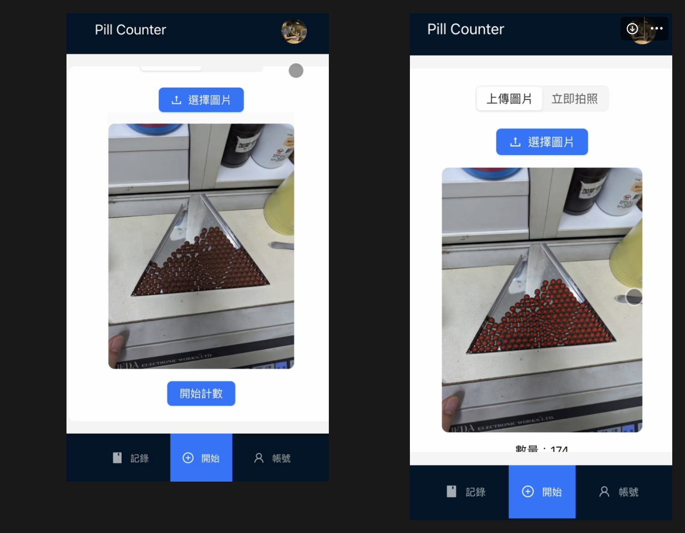

## Pill Counter App

> You can find further detail from this website: [Pill Counter App Explain](https://wood-pecorino-16c.notion.site/Pill-Counter-App-7b054118ce5e4e0180bc39a10a7f57dc)

### Introduction

My friend, who is a pharmacist, often needs to count various pills one by one to complete the medication packaging process. To alleviate this tedious task, I developed a simple app that uses an artificial intelligence (AI) model to automatically identify and count the number of pills in a photo, providing an immediate and accurate result.

### Demo

### Project Objectives

- Develop a user-friendly and easy-to-operate web page
- Enable quick interpretation of pill counts from uploaded photos
- Maintain records of each interpretation for manual review

### Features

- Use PWA to allow users to install the website on their mobile devices to simulate the experience of a native app.
- Use Google third-party authentication to eliminate the need for users to register separately.
- Support uploading images or taking photos instantly, and the system will quickly interpret the number of pills
- Visually present the AI model's prediction results on the images by marking each pill with a red dot
- Retain prediction records for 7 days for manual review and support adding notes to prediction records
- Integrate Neweb Pay for subscription management after exceeding the trial limit

### Pending Tasks

- Attempted to run containerized services on AWS EC2, but encountered issues with large Docker image transfers.
  - Future steps could include optimizing the server's package dependencies.
  - The production environment should only require inference functionality, so trimming down the YOLO v8-related training libraries can help reduce the image size.
- Attempted to deploy the React Web App on [Netlify](https://www.netlify.com/), but deployment has been temporarily halted due to issues with setting up the AWS server.

### Conclusion

This project aims to address the tedious task of manual pill counting faced by pharmacists during the medication packaging process. By developing a user-friendly web application, pharmacists can easily upload images or take photos instantly, and the system will quickly and accurately interpret the number of pills, marking each pill with a red dot. Additionally, prediction results will be retained for 7 days to facilitate manual review and note-taking. The integration of BluePay ensures that users can seamlessly subscribe and make payments after exceeding the trial limit. This application not only improves work efficiency but also reduces manual counting errors, providing significant convenience for pharmacists in their daily work.
